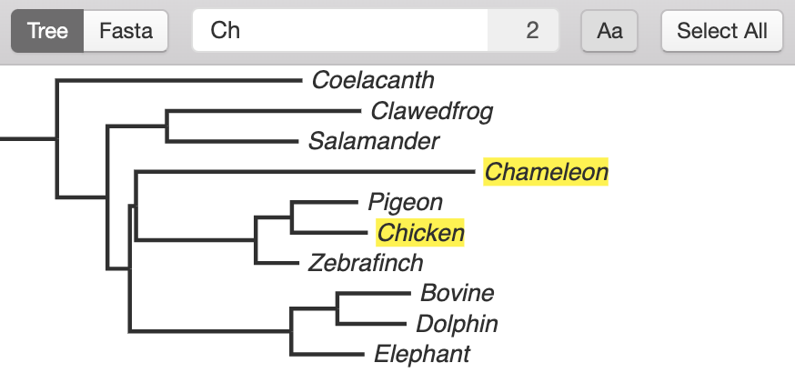

Basics
======

Taxus is designed to be to link a tree and a fasta file to edit for downstream analysis.

Trees Opening and Saving
------------------------

Taxus can load trees in NEXUS and Newick formats.

To open the tree, select :menuselection:`File --> Open Tree`.

Trees are saved in NEXUS format.

To save the tree, select :menuselection:`File --> Save Tree` or :menuselection:`File --> Save Tree As...` if you want to save the tree under a different name.

Navigation
----------

| To move the tree press and hold :kbd:`Ctrl` button, then click and drag inside the tree display area.
| To zoom in and out press and hold :kbd:`Ctrl` button, then scroll inside the tree display area.

Additionally there are "Zoom out" and "Zoom in" buttons in the toolbar (|zoom_actions|).

.. |zoom_actions| image:: _static/img/zoom_actions.png
  :scale: 50%

.. _branch_taxa_selection:

Branch/Taxa Selection
---------------------

Selection can be performed simply by clicking on the branch or taxa of the tree. Multiple objects can be selected at the same time by clicking and dragging to create a selection box.

Elements of a tree can be selected in two modes: branch and taxa.

Only taxa can be selected while using **taxa** selection mode. Use taxa mode to annotate or remove sequences from fasta file.

Branches and their descendants can be selected in **branch** selection mode. Use branch selection mode to reroot the tree, rotate clades, and select descendant branches or taxa.

To switch between modes, click the corresponding buttons in the toolbar. Alternatively, selection modes can be toggled using :menuselection:`Edit --> Toggle Selection Mode`.

.. image:: _static/img/selection_modes.png
  :scale: 75%

.. image:: _static/img/rectangular_selection.png
  :scale: 50%
  :align: center

Pressing and holding :kbd:`Shift` while selecting allows to select multiple items.

.. image:: _static/img/multiple_selection.gif
  :scale: 75%
  :align: center

When branch mode is enabled and one or several internal branches are selected, the **Select Descendants** tool will select all descendant branches and taxa. The action is performed by clicking the corresponding button in the toolbar (|select_descentants_button|) or by selecting :menuselection:`Edit --> Select Descendants`.

.. |select_descentants_button| image:: _static/img/select_descentants_button.png
  :scale: 50%

.. image:: _static/img/select_descendants.gif
  :scale: 75%
  :align: center

All the branches/taxa of the tree can be selected using :menuselection:`Edit --> Select All in Tree`.

Tree Visualization and Modification
-----------------------------------

Changing the Proportions
########################

To expand or contract tree by width or height use the group of tools (|expand_contract_buttons|) on the left side of the toolbar.

.. |expand_contract_buttons| image:: _static/img/expand_contract_buttons.png
  :scale: 50%

.. Note:: The Expand/Contract tools don't modify the tree file. They only change the way how the tree is displayed.

Cladogram View
##############
To enter or exit the cladogram view of the tree select :menuselection:`Edit --> Toggle Cladogram View` in Main Menu.

Rerooting and Clade Rotation
############################

To reroot the tree, in branch mode, select the branch you want to reroot and click the "Reroot Tree" button in the toolbar (|reroot_button|) or by selecting :menuselection:`Edit --> Reroot`

To rotate the clade, select the branch and click the "Rotate branch" button in the toolbar (|rotate_button|) or by selecting :menuselection:`Edit --> Rotate`

.. |reroot_button| image:: _static/img/reroot_button.png
  :scale: 50%

.. |rotate_button| image:: _static/img/rotate_button.png
  :scale: 50%

.. note:: Rerooting and Rotation operations change the tree topology. To apply changes to the file the tree should be saved.

Sorting
#######

It is possible to sort nodes by the length of the path from the root.

To sort nodes ascending select :menuselection:`Edit --> Order Nodes Ascending`

To sort nodes descending select :menuselection:`Edit --> Order Nodes Descending`

To revert to the original order select :menuselection:`Edit --> Restore Original Node Order`

.. note:: Sorting changes the tree topology. To apply changes to the file the tree should be saved.

Applying Colors
###############
The branches and taxa can be colored.

To apply a new color to selected objects, click the "Change color" button from the toolbar (|apply_color_button|).

.. |apply_color_button| image:: _static/img/apply_color_button.png
  :scale: 50%

.. image:: _static/img/apply_color.png
  :scale: 50%
  :align: center

HEX code of color can be specified. Taxus saves previously selected colors to the history bar at the bottom of the color window.

To remove the color annotation from selected branches/taxa, click the "Remove Color" button (|remove_color_button|).

.. |remove_color_button| image:: _static/img/remove_color_button.png
  :scale: 50%

Applying colors in **taxa** selection mode will apply them to text, while doing it in **branch** selection mode will change colors of branches (see :ref:`Branch/Taxa Selection<branch_taxa_selection>`).

Other Preferences
#################

Select :menuselection:`File --> Preferences` (:menuselection:`Taxus --> Preferences` in macOS) to enter the Preferences window.

.. image:: _static/img/preferences_window.png
  :scale: 50%
  :align: center

* **Branch width** option specifies the width of the tree branches (in pixels)
* **Default branch color** option defines the default color of the branches and taxa that are not colored manually
* **Show alignment coverage** - show the proportion of data represented in the sequence alignment (visible only if fasta file is loaded)
* **Show bootstrap** - show the bootstrap support of the clades (if it specified in the tree)
* **Taxa label font** option specifies the type, size, and decorations of the font used for taxa names

.. Note:: The settings are not global. All the settings in the Preferences window affect the current tree only and appear in the file with the tree. Changes in Preferences will not influence the trees you will open in the future.

Search
------

Click the search button (|search_button|) to open the search panel.

| The search work in two modes:
| * |search_tree_mode_button| - search inside the tree
| * |search_fasta_mode_button| - search inside fasta file (if loaded)

Next to the search field, the number of occurrences is displayed.

To make a search case sensitive, press the "Case sensitive search" button (|search_case_sensitive_button|)

To select all the found taxa, press |search_select_all_button| button.

Exporting
---------

The current tree view can be exported to vector SVG or raster PNG format.

These actions can be performed by selecting :menuselection:`File --> Export to...` group in the main menu.
