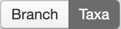
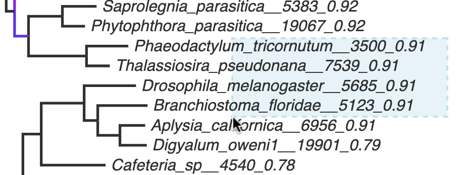
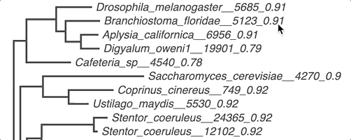
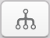
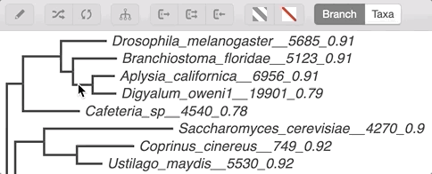
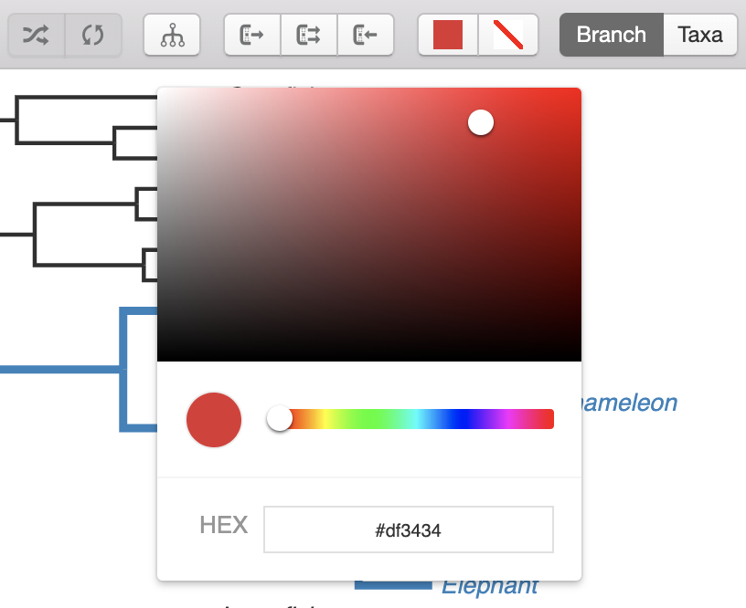
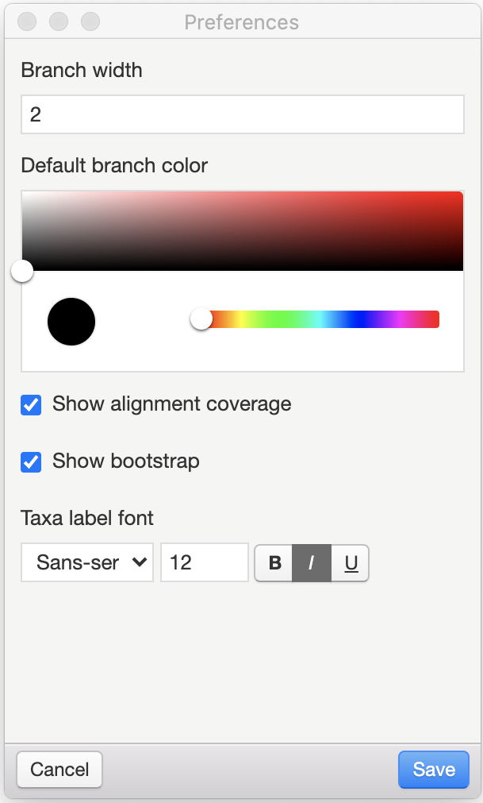

Basics
======

Opening trees
-------------

The software supports NEXUS and Newick formats.

To open the tree select :menuselection:`File --> Open Tree`.

Navigation
----------

| To pan the tree press and hold :kbd:`Ctrl` button, then click and drag inside the tree display area.
| To zoom the tree press and hold :kbd:`Ctrl` button, then scroll a mouse wheel inside the tree display area.

For zooming it is also possible to click "Zoom out" and "Zoom in" buttons of the tool bar (|zoom_actions|).

Branch/Taxa selection
---------------------

There are two modes of selection: branch and taxa.

To change the mode click corresponding buttons in the toolbar.

| In **taxa** selection mode all the selection will be restricted by the leaves of the tree.
| In **branch** selection no selection restrictions will be applied.

| Selection can be performed simply by clicking on the branch or taxa.
| Click and drag in the tree display area initiates rectangular selection for picking several objects at the same time.

Pressing and holding :kbd:`Shift` while selecting allows to select multiple items.

When a branch mode is enabled and one or several internal branches are selected it's possible to use **Select Descendants** action to select all the children elements of selected items. The action is performed by clicking the corresponding button in the tool bar (|select_descentants_button|) or by selecting :menuselection:`Edit --> Select Descendants`.

Tree visualization and modification
-----------------------------------

Changing the Proportions
########################

To expand or contract tree by width or height use the group of tools on the left side of toolbar.

.. Note:: The Expand/Contract actions don't modify the tree file, they are used for improving the way how the tree is displayed only.

Cladogram View
##############
To enter cladogram view of the tree select :menuselection:`Edit --> Select Descendants` in Main Menu.

Select the option again to return to standard view.

Rerooting and Clade Rotation
############################

To reroot the tree select the branch you want to reroot to and click the "Reroot Tree" button from the tool bar (|reroot_button|) or by selecting :menuselection:`Edit --> Reroot`

To rotate the clade select the branch and click the "Rotate branch" button from the tool bar (|rotate_button|) or by selecting :menuselection:`Edit --> Rotate`

.. note:: Rerooting and Rotation operations change the tree topology. To apply changes to the file the tree should be saved afterwards.

Applying Colors
###############
The branches and taxa can be colored.

To apply a new color to selected objects click "Change color" button from the tool bar (|apply_color_button|).

HEX code of color can be specified, previously selected colors are saved to the history bar of color picker window.

To remove color annotation from selected branches/taxa click the "Remove Color" button (|remove_color_button|).

Other Preferences
#################

Select :menuselection:`File --> Preferences` (:menuselection:`Sequoia --> Preferences` in macOS) to enter the Preferences window.

* **Branch width** option specifies the width of the tree branches (in pixels)
* **Default branch color** option defines the default color of the branches and taxa that are not colored manually
* **Show alignment coverage** - show or hide the proportion of #TODO (visible only if fasta file is loaded)
* **Show bootstrap** - show or hide the bootstrap support of the clades (if it is specified in the tree)
* **Taxa label font** option specifies the type, size and decorations of the font used for taxa names

.. Note:: The settings are not global. All the settings in the Preferences window work only for the current tree and are saved to the tree file. Changes in Preferences will not influence the trees you will open in future.

Shortcuts
---------

.. csv-table::
  :header: "Action", "Shortcut (Windows, Linux)", "Shortcut (Mac)"
  :align: center

  "Open Tree", :kbd:`Ctrl` + :kbd:`O`, :kbd:`Cmd` + :kbd:`O`
  "Zoom Out", :kbd:`Ctrl` + :kbd:`-`, :kbd:`Cmd` + :kbd:`-`
  "Zoom In", :kbd:`Ctrl` + :kbd:`+`, :kbd:`Cmd` + :kbd:`+`
  "Pan Up", :kbd:`🡓`, :kbd:`🡓`
  "Pan Down", :kbd:`🡑`, :kbd:`🡑`
  "Pan Left", :kbd:`🡒`, :kbd:`🡒`
  "Pan Right", :kbd:`🡐`, :kbd:`🡐`
    "Toggle cladogram View", :kbd:`Shift` + :kbd:`Ctrl` + :kbd:`C`, :kbd:`Shift` + :kbd:`Cmd` + :kbd:`C`
  "Reroot tree", :kbd:`Ctrl` + :kbd:`R`, :kbd:`Cmd` + :kbd:`R`
  "Rotate branch", :kbd:`Shift` + :kbd:`Ctrl` + :kbd:`R`, :kbd:`Shift` + :kbd:`Cmd` + :kbd:`R`
