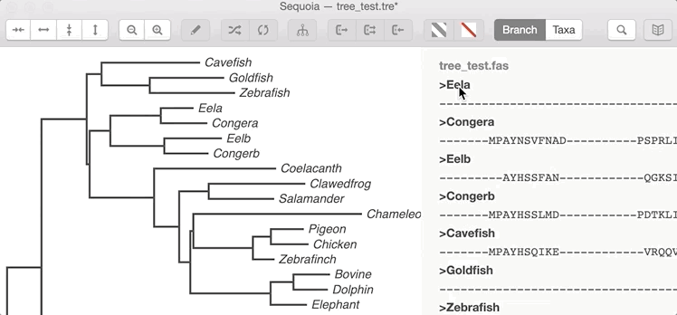
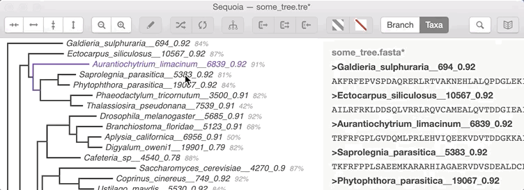
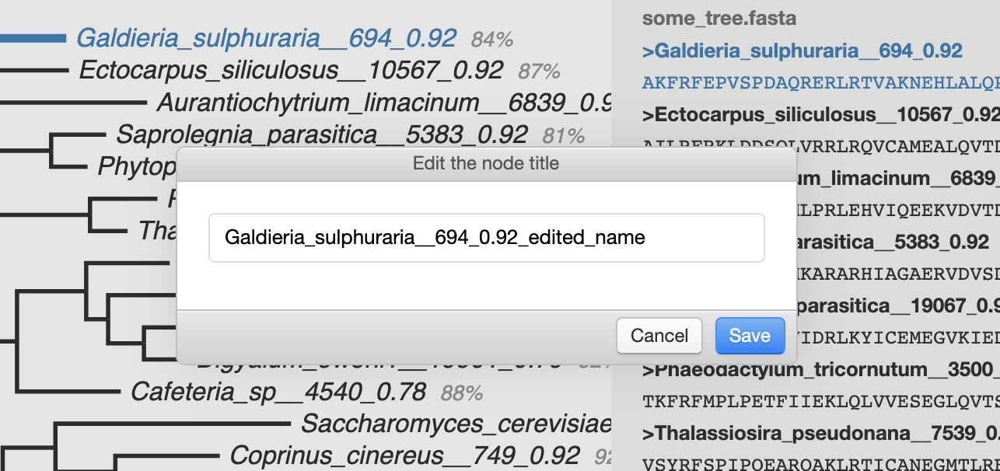

Fasta Files
===========

After opening a tree file it's possible to import a fasta file the tree built from.

.. Attention:: The fasta file must have the same number of sequences as the number of taxa in the tree. Tree taxa names and fasta file headers also must be the same.

Opening and Saving Fasta Files
------------------------------

To open a fasta file, select :menuselection:`File --> Open Fasta`.

.. Note:: It is possible to apply a fasta file only if the tree is loaded.

To save a fasta file, select :menuselection:`File --> Save Fasta` or :menuselection:`File --> Save Fasta as...` if you want to save the file under a different name.

"Save Fasta" action doesn't rewrite the original file but saves a copy with `.fangorn.` in the name.

Fasta Panel
-----------

To view the fasta panel, press "Show Fasta" button in the toolbar (|fasta_panel_button|).

The panel contains the name of the currently opened file and it's content.

Removing Sequences
------------------

Sequences of one or several selected taxa in the tree can be removed from the fasta file.

To remove entries from fasta use the group of removal instruments in the toolbar or select :menuselection:`Edit --> Delete selected`, :menuselection:`Edit --> Delete unselected`, :menuselection:`Edit --> Keep selected` from the main menu.

* |remove_selected_button| - remove selected taxa from the fasta file
* |remove_unselected_button| - remove all unselected taxa from the fasta file
* |return_selected_button| - return selected taxa to fasta file

Headers editing
---------------

When the fasta file is loaded it is possible to change the name of a taxon in the tree and in the fasta simultaneously.

To change the name of a taxon select it and click the "Annotate Node" button (|annotate_node_button|).

Edit the name of in the window and press "Save".

.. Note:: This operation changes a tree and a fasta file. To apply changes to files both tree and fasta files should be saved.

Copying sequences
-----------------

When the fasta file is opened and one or several taxa is selected the sequences can be copied to system clipboard using :menuselection:`Edit --> Copy` action in the main menu (or standard Copy keystroke of your OS).
